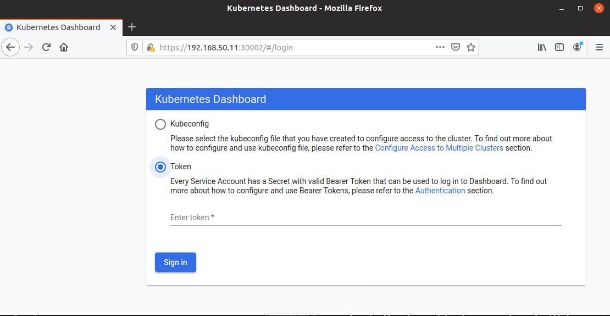
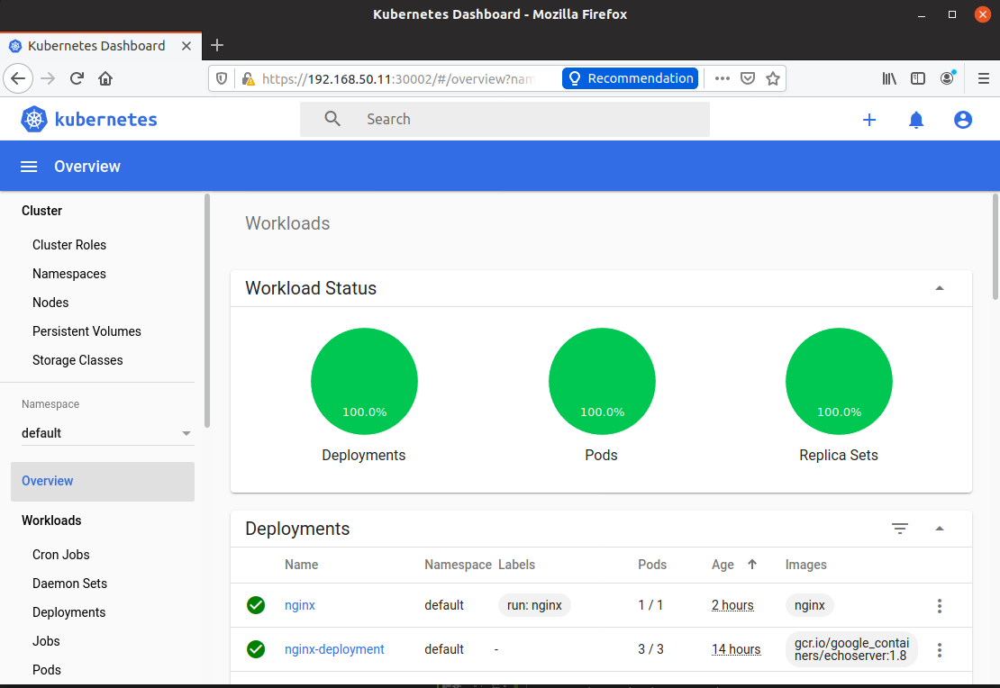

# Building the base Kubernetes system

The base system consists of the following components:   
 
1. Install curl
1. Install Virtual box
1. Install Vagrant
1. Install Ansible
1. Install a kubernetes cluster, with 1 master and 2 nodes
1. Install the kubernetes Dashboard 
1. Install a Load balancer (metallb)
1. Install Dynamic Storage Volume Creation in Kubernetes
1. Install NFS Server on the host
1. Install Helm 
1. Install Istio
1. Install HAProxy 
1. Allow other machines to access the cluster 
1. Useful commands
1. Further research to do items


Curl Install
---
Installing curl through the command line   
```bash
sudo apt install curl
```

Install Virtual box
---

Installing VirtualBox Through the Command line

```bash
sudo add-apt-repository multiverse && sudo apt-get update
sudo apt install virtualbox
```


Install the Extension Package

```bash
sudo apt install virtualbox-ext-pack
```

Check the virtual box version, it should b 6.0 or above

```bash
vboxmanage --version
$ 6.0.6_Ubuntur129722
```

Run virtual box with

```bash
virtualbox
```

Install vagrant
-----

Start by updating the package list with:
```bash
sudo apt update
```

Download the Vagrant package using the following curl command:

```bash
curl -O https://releases.hashicorp.com/vagrant/2.2.6/vagrant_2.2.6_x86_64.deb
```

Once the .deb file is downloaded, install it by typing:

```bash
sudo apt install ./vagrant_2.2.6_x86_64.deb
```

Verify Vagrant installation
To verify that the installation was successful, run the following command which prints the Vagrant version:

```bash
vagrant --version
```

The output should look something like this:
```bash
Vagrant 2.2.6
```

Install Ansible
---

Installing Ansible on the Command line

```bash
sudo apt update
sudo apt install software-properties-common
sudo apt-add-repository --yes --update ppa:ansible/ansible
sudo apt install ansible -y
```

Check the version of Ansible   
```bash
$ ansible --version

ansible 2.9.6
  config file = /etc/ansible/ansible.cfg
  configured module search path = [u'/home/eamonfoy/.ansible/plugins/modules', u'/usr/share/ansible/plugins/modules']
  ansible python module location = /usr/lib/python2.7/dist-packages/ansible
  executable location = /usr/bin/ansible
  python version = 2.7.17 (default, Nov  7 2019, 10:07:09) [GCC 7.4.0]


```


Install a kubernetes cluster, with 1 master and 2 nodes
---

This section assumes you have successfully downloaded source code. 
From the root of the source code folder follow the following commands   
```bash
cd 1_base_system_build/kubernetes-vagrant_cluster
```

This section assumes you have successfully downloaded source code. 
From the root of the source code folder follow the following commands
```bash
vagrant up
```
This command will take a while depending on your internet speed and also the capacity of your machine. For me it was around 10 minutes.

This section is inspired by a tutorial found [here](https://github.com/ITWonderLab/ansible-vbox-vagrant-kubernetes)

We are going to use vagrant to set up the following vm's which will contain the kubernetes cluster:

| vm(s) | Description |IP |  | RAM | vCPU|
| ------------|--- | ------------- | ------------- |------------- |------------- |
| K8S-M-1 | Kubernetes Master |192.168.50.11||4Gb|4|
| K8S-N-1 | Kubernetes Node 1 |192.168.50.12||16GB|4|
| K8S-N-2 | Kubernetes Node 2 |192.168.50.13||16GB|4|
| K8S-N-3 | Kubernetes Node 3 |192.168.50.14||16GB|4|

Virtualbox NAT network setting are: 

|  Description            | IP           | 
| ------------------------| -------------|
| host                    | 10.0.0.45    | 
| vboxnet0 virtual iface  | 192.168.50.1 |

Virtual box creates routes which you will need to make not of 
```bash
$ route
Kernel IP routing table
Destination     Gateway         Genmask         Flags Metric Ref    Use Iface
default         _gateway        0.0.0.0         UG    100    0        0 eno1
10.0.0.0        0.0.0.0         255.255.255.0   U     100    0        0 eno1
link-local      0.0.0.0         255.255.0.0     U     1000   0        0 eno1
192.168.50.0    0.0.0.0         255.255.255.0   U     0      0        0 vboxnet0
```

To ssh in to the master node use the following:
```bash
ssh vagrant@192.168.50.11

Note when it asks for a password type : vagrant
```bash   

Now I am on the kubernetes master
```bash
ssh vagrant@192.168.50.11
The authenticity of host '192.168.50.11 (192.168.50.11)' can't be established.
ECDSA key fingerprint is SHA256:7ok3hLsAT6RMxwYkoISSQ5Xltpglng6eQ6ZJk/bkOMY.
Are you sure you want to continue connecting (yes/no)? yes
Warning: Permanently added '192.168.50.11' (ECDSA) to the list of known hosts.
vagrant@192.168.50.11's password: 
Welcome to Ubuntu 18.04.4 LTS (GNU/Linux 4.15.0-76-generic x86_64)

* Documentation:  https://help.ubuntu.com
* Management:     https://landscape.canonical.com
* Support:        https://ubuntu.com/advantage

System information as of Sat Feb  8 23:46:48 UTC 2020

System load:  1.23              Users logged in:        0
Usage of /:   5.7% of 61.80GB   IP address for eth0:    10.0.2.15
Memory usage: 40%               IP address for eth1:    192.168.50.11
Swap usage:   0%                IP address for docker0: 172.17.0.1
Processes:    146               IP address for tunl0:   192.168.116.0

* Multipass 1.0 is out! Get Ubuntu VMs on demand on your Linux, Windows or
Mac. Supports cloud-init for fast, local, cloud devops simulation.

    https://multipass.run/

9 packages can be updated.
9 updates are security updates.


This system is built by the Bento project by Chef Software
More information can be found at https://github.com/chef/bento
Last login: Sat Feb  8 21:56:40 2020 from 10.0.2.2
```    
   
While we are on the kubernetes master we can check the status of the cluster:    
```bash
kubectl get all
```   

# Installing kubectl on host 
This will enable us to administer the Kubernetes Cluster from  host and not needing to log into the master.   
Run the following commands from the host machine:    

```bash   

sudo apt-get update && sudo  apt-get install -y apt-transport-https

curl -s https://packages.cloud.google.com/apt/doc/apt-key.gpg | sudo apt-key add -

echo "deb https://apt.kubernetes.io/ kubernetes-xenial main" | sudo tee -a /etc/apt/sources.list.d/kubernetes.list

sudo apt-get update

sudo apt-get install -y kubectl
```

Copy the Kubernetes config 
---
This series of steps will copy the Kubernetes config to your local home .kube dir

Create the configuration directory   
   
```bash   
$ mkdir -p ~/.kube   
```   

Find the SSH port of the k8s-m-1 server   

```bash
$ vagrant port k8s-m-1

The forwarded ports for the machine are listed below. Please note that
these values may differ from values configured in the Vagrantfile if the
provider supports automatic port collision detection and resolution.
    22 (guest) => 2222 (host)
```

Copy the file using scp (ssh password is vagrant)
```bash
$ scp -P 2222 vagrant@127.0.0.1:/home/vagrant/.kube/config ~/.kube/config

vagrant@127.0.0.1's password: vagrant
config                                                                     100% 5449   118.7KB/s   00:00
```   

Check is kubectl working
---

List the Kubernetes cluster nodes using  kubectl from your development host:   

```bash
$ kubectl cluster-info

Kubernetes master is running at https://192.168.50.11:6443
KubeDNS is running at https://192.168.50.11:6443/api/v1/namespaces/kube-system/services/kube-dns:dns/proxy

```

Check the status of the nodes   
```bash
$ kubectl get nodes --all-namespaces
NAME      STATUS   ROLES    AGE   VERSION
k8s-m-1   Ready    master   49m   v1.17.2
k8s-n-1   Ready    <none>   46m   v1.17.2
k8s-n-2   Ready    <none>   43m   v1.17.2
```
Check the status of all the pods   

```bash
$ kubectl get pods --all-namespaces
NAMESPACE     NAME                                       READY   STATUS    RESTARTS   AGE
kube-system   calico-kube-controllers-6895d4984b-jbg6r   1/1     Running   0          52m
kube-system   calico-node-pftj4                          1/1     Running   0          52m
kube-system   calico-node-vdshc                          1/1     Running   0          6m
kube-system   calico-node-w7s7v                          1/1     Running   0          49m
kube-system   coredns-6955765f44-6qk9z                   1/1     Running   0          52m
kube-system   coredns-6955765f44-tqll4                   1/1     Running   0          52m
kube-system   etcd-k8s-m-1                               1/1     Running   0          52m
kube-system   kube-apiserver-k8s-m-1                     1/1     Running   0          52m
kube-system   kube-controller-manager-k8s-m-1            1/1     Running   0          52m
kube-system   kube-proxy-6f692                           1/1     Running   0          52m
kube-system   kube-proxy-6fhzt                           1/1     Running   0          46m
kube-system   kube-proxy-h72z6                           1/1     Running   0          49m
kube-system   kube-scheduler-k8s-m-1                     1/1     Running   0          52m

```

# Deploy a test app to check if the cluster is working

This section assumes you have successfully downloaded source code.    
From the root of the source code folder follow the following commands   
```bash
cd 1_base_system_build/kubernetes-vagrant_cluster
```
Deploy nginx to the cluster
```bash
$ kubectl apply -f nginx.yaml 
deployment.apps/nginx-deployment created
service/nginx-service-np created
```

We need to check the application has been deployed correctly.   
To do this we will now check the two nodes using curl to check that nginx got deployed correctly. 

Check Node 1
```bash
$ curl http://192.168.50.12:30000/

Hostname: nginx-deployment-569b77699b-lvstv

Pod Information:
	-no pod information available-

Server values:
	server_version=nginx: 1.13.3 - lua: 10008

Request Information:
	client_address=192.168.122.0
	method=GET
	real path=/
	query=
	request_version=1.1
	request_uri=http://192.168.50.12:8080/

Request Headers:
	accept=*/*
	host=192.168.50.12:30000
	user-agent=curl/7.64.0

Request Body:
	-no body in request-


```
Check Node 2
```bash
$ curl http://192.168.50.13:30000/

Hostname: nginx-deployment-569b77699b-lvstv

Pod Information:
	-no pod information available-

Server values:
	server_version=nginx: 1.13.3 - lua: 10008

Request Information:
	client_address=192.168.122.0
	method=GET
	real path=/
	query=
	request_version=1.1
	request_uri=http://192.168.50.13:8080/

Request Headers:
	accept=*/*
	host=192.168.50.13:30000
	user-agent=curl/7.64.0

Request Body:
	-no body in request-

```

# Install the kubernetes Dashboard  

The Kubernetes Dashboard provides a web-based user interface to deploy applications, troubleshoot and manage resources. The same functionality is provided through the command line tools but under a very nice web application with charts and beautiful screens.

To deploy the Web UI (Dashboard) or Kubernetes Dashboard run the following command:

```bash
kubectl apply -f https://raw.githubusercontent.com/kubernetes/dashboard/v2.0.0-beta8/aio/deploy/recommended.yaml

```

The deployment file will publish the Kubernetes Dashboard using a ClusterIP service as shown below using TargetPort 8443:

```bash
$ kubectl -n kubernetes-dashboard describe service kubernetes-dashboard
```
response:
```
Name:              kubernetes-dashboard
Namespace:         kubernetes-dashboard
Labels:            k8s-app=kubernetes-dashboard
Annotations:       kubectl.kubernetes.io/last-applied-configuration:
                     {"apiVersion":"v1","kind":"Service","metadata":{"annotations":{},"labels":{"k8s-app":"kubernetes-dashboard"},"name":"kubernetes-dashboard"...
Selector:          k8s-app=kubernetes-dashboard
Type:              ClusterIP
IP:                10.109.172.25
Port:              <unset>  443/TCP
TargetPort:        8443/TCP
Endpoints:         192.168.122.129:8443
Session Affinity:  None
Events:            <none>

```

In order to access the Kubernetes Dashboard from our workstation, a NodePort will be created to publish the kubernetes-dashboard following the Publish an Application Outside Kubernetes Cluster instructions.

The file kubernetes-dashboard-service-np.yaml:

Creates an admin-user
Assigns the cluster-admin role
Creates a new NodePort service that publishes TargetPort 8443 as NodePort 30002:

```yaml
--- 
apiVersion: v1
kind: ServiceAccount
metadata:
  name: admin-user
  namespace: kubernetes-dashboard
--- 
apiVersion: rbac.authorization.k8s.io/v1
kind: ClusterRoleBinding
metadata:
  name: admin-user
roleRef:
  apiGroup: rbac.authorization.k8s.io
  kind: ClusterRole
  name: cluster-admin
subjects:
- kind: ServiceAccount
  name: admin-user
  namespace: kubernetes-dashboard
---   
kind: Service
apiVersion: v1
metadata:
  namespace: kubernetes-dashboard
  name: kubernetes-dashboard-service-np
  labels:
    k8s-app: kubernetes-dashboard
spec:
  type: NodePort
  ports:
  - port: 8443
    nodePort: 30002
    targetPort: 8443
    protocol: TCP
  selector:
    k8s-app: kubernetes-dashboard
```


Apply the changes:
```bash
kubectl apply -f kubernetes-dashboard-service-np.yaml 
```   
Obtain an authentication token to use on the Kubernetes Dashboard authentication realm:   
```bash
kubectl -n kubernetes-dashboard describe secret $(kubectl -n kubernetes-dashboard get secret | grep admin-user | awk '{print $1}')
```   
The command will print out the token, yours will be different than mine   
```bash   
kubectl -n kubernetes-dashboard describe secret $(kubectl -n kubernetes-dashboard get secret | grep admin-user | awk '{print $1}')
Name:         admin-user-token-vjh27
Namespace:    kubernetes-dashboard
Labels:       <none>
Annotations:  kubernetes.io/service-account.name: admin-user
              kubernetes.io/service-account.uid: ab754545-5c40-463a-9ce7-0f8d19279d23

Type:  kubernetes.io/service-account-token

Data
====
ca.crt:     1025 bytes
namespace:  20 bytes
token:      eyJhbGciOiJSUzI1NiIsImtpZCI6Ik4xeGprVGNuMzBWRGtLamhVRGRYZl9YaTY3TWNBTlByQWFaei1YeUNuUFUifQ.eyJpc3MiOiJrdWJlcm5ldGVzL3NlcnZpY2VhY2NvdW50Iiwia3ViZXJuZXRlcy5pby9zZXJ2aWNlYWNjb3VudC9uYW1lc3BhY2UiOiJrdWJlcm5ldGVzLWRhc2hib2FyZCIsImt1YmVybmV0ZXMuaW8vc2VydmljZWFjY291bnQvc2VjcmV0Lm5hbWUiOiJhZG1pbi11c2VyLXRva2VuLXZqaDI3Iiwia3ViZXJuZXRlcy5pby9zZXJ2aWNlYWNjb3VudC9zZXJ2aWNlLWFjY291bnQubmFtZSI6ImFkbWluLXVzZXIiLCJrdWJlcm5ldGVzLmlvL3NlcnZpY2VhY2NvdW50L3NlcnZpY2UtYWNjb3VudC51aWQiOiJhYjc1NDU0NS01YzQwLTQ2M2EtOWNlNy0wZjhkMTkyNzlkMjMiLCJzdWIiOiJzeXN0ZW06c2VydmljZWFjY291bnQ6a3ViZXJuZXRlcy1kYXNoYm9hcmQ6YWRtaW4tdXNlciJ9.EF4A9y3dbItftR7FGHEBW4oG5dJkzezI2Cb9Zt4SdWWJ8QZKt9TjTzUDBlAtj7D_oaEYtgfCO9Bu0c4B5o-DgE3G9pqi6mvhVNqyXxVB4x00AtHps5--kgznnSxN7dvOWPEQWtlY2ZRUAFPAenMQ0JjzkKqirldn9rd1KY1SNiSa1HMcCBYayjf0CzRVuvGqwpkk66LWSNyYbopSw7MbQJvIzpO6wI5tH6ArU6IUjxTly0HFEc_IsT5nFzgweKWh3ZltmGOs6XeLDYXTWp4Z0aHB31w-7YfKoq9L-UDAAji8jpPqQeyZZtw20G0sUNPW-2xPGiWDZPIQljZcIfO-Rw
```   

Copy the token part on to the cipboard for later   


Access the Kubernetes Dashboard using the URL https://192.168.50.11:30002/#/login



Using the token copied to the cipboard, paste in and click signin. This will allow you to login in to the Dasboard:




# Install a Load balancer (metallb)

Background
---
Because Kubernetes does not offer an implementation of network load-balancers (Services of type LoadBalancer) for bare metal clusters.

The implementations of Network LB that Kubernetes does ship with are all glue code that calls out to various IaaS platforms (GCP, AWS, Azure…). If you’re not running on a supported IaaS platform (GCP, AWS, Azure…), LoadBalancers will remain in the “pending” state indefinitely when created.

Bare metal cluster operators are left with two lesser tools to bring user traffic into their clusters, “NodePort” and “externalIPs” services. Both of these options have significant downsides for production use, which makes bare metal clusters second class citizens in the Kubernetes ecosystem.

[MetalLB](https://metallb.universe.tf/installation/) aims to redress this imbalance by offering a Network LB implementation that integrates with standard network equipment, so that external services on bare metal clusters also “just work” as much as possible.

To install [MetalLB](https://metallb.universe.tf/installation/), apply the following manifest:
---   

```bash      
kubectl apply -f https://raw.githubusercontent.com/google/metallb/v0.8.3/manifests/metallb.yaml
```

To configure metal lb we need ti find out more about the addressing which is being used within the cluster:   

```bash   
$ kubectl get nodes -o wide
NAME      STATUS   ROLES    AGE   VERSION   INTERNAL-IP     EXTERNAL-IP   OS-IMAGE             KERNEL-VERSION      CONTAINER-RUNTIME
k8s-m-1   Ready    master   12h   v1.17.2   192.168.50.11   <none>        Ubuntu 18.04.4 LTS   4.15.0-76-generic   docker://19.3.5
k8s-n-1   Ready    <none>   12h   v1.17.2   192.168.50.12   <none>        Ubuntu 18.04.4 LTS   4.15.0-76-generic   docker://19.3.5
k8s-n-2   Ready    <none>   12h   v1.17.2   192.168.50.13   <none>        Ubuntu 18.04.4 LTS   4.15.0-76-generic   docker://19.3.5
```

Metallb is configured using the following command   
Note:
- The ip **addresss** range below will need to be changed depending on you kubernetes deployment. The previous command will advise you on which network range to use   
```bash   
cat <<EOF | kubectl create -f -
apiVersion: v1
kind: ConfigMap
metadata:
  namespace: metallb-system
  name: config
data:
  config: |
    address-pools:
    - name: default
      protocol: layer2
      addresses:
      - 192.168.50.240-192.168.50.250
EOF
```
**** ONLY REQUIRED IF YOUR RUN IN TO BOTHER ***
Check that the configuration is set by using the following command

```bash
kubectl get configmap -n metallb-system config -o json
```

Just in case you need to delete this configuration and strat over, here is the command:

```bash 
kubectl delete configmap -n metallb-system config 
```


Testing the load balancer
---

Deploy a simple nginx container
```bash   
kubectl run nginx --image nginx
```

Create a loadbalancer service to expose the service on port 80   
```bash   
kubectl expose deploy nginx --port 80 --type LoadBalancer
```   
list all to see
```bash   
kubectl get all -o wide
```
See below the service is exposed on ip 192.168.50.240 port 80:32049   
```bash   
NAME                                    READY   STATUS    RESTARTS   AGE   IP                NODE      NOMINATED NODE   READINESS GATES
pod/nginx-6db489d4b7-6mbm2              1/1     Running   0          81s   192.168.122.133   k8s-n-2   <none>           <none>
pod/nginx-deployment-569b77699b-44hs4   1/1     Running   1          12h   192.168.122.2     k8s-n-1   <none>           <none>
pod/nginx-deployment-569b77699b-6t4z7   1/1     Running   1          12h   192.168.122.132   k8s-n-2   <none>           <none>
pod/nginx-deployment-569b77699b-lvstv   1/1     Running   1          12h   192.168.122.131   k8s-n-2   <none>           <none>

NAME                       TYPE           CLUSTER-IP      EXTERNAL-IP      PORT(S)          AGE   SELECTOR
service/kubernetes         ClusterIP      10.96.0.1       <none>           443/TCP          13h   <none>
service/nginx              LoadBalancer   10.104.202.13   192.168.50.240   80:32049/TCP     27s   run=nginx
service/nginx-service-np   NodePort       10.103.144.87   <none>           8082:30000/TCP   12h   app=nginx

NAME                               READY   UP-TO-DATE   AVAILABLE   AGE   CONTAINERS   IMAGES                                    SELECTOR
deployment.apps/nginx              1/1     1            1           81s   nginx        nginx                                     run=nginx
deployment.apps/nginx-deployment   3/3     3            3           12h   my-echo      gcr.io/google_containers/echoserver:1.8   app=nginx

NAME                                          DESIRED   CURRENT   READY   AGE   CONTAINERS   IMAGES                                    SELECTOR
replicaset.apps/nginx-6db489d4b7              1         1         1       81s   nginx        nginx                                     pod-template-hash=6db489d4b7,run=nginx
replicaset.apps/nginx-deployment-569b77699b   3         3         3       12h   my-echo      gcr.io/google_containers/echoserver:1.8   app=nginx,pod-template-hash=569b77699b

```   

Test that everything is working by using curl as follows:    
```bash   
$ curl 192.168.50.240:80
```
Response will be as follows:   
```html
<!DOCTYPE html>
<html>
<head>
<title>Welcome to nginx!</title>
<style>
    body {
        width: 35em;
        margin: 0 auto;
        font-family: Tahoma, Verdana, Arial, sans-serif;
    }
</style>
</head>
<body>
<h1>Welcome to nginx!</h1>
<p>If you see this page, the nginx web server is successfully installed and
working. Further configuration is required.</p>

<p>For online documentation and support please refer to
<a href="http://nginx.org/">nginx.org</a>.<br/>
Commercial support is available at
<a href="http://nginx.com/">nginx.com</a>.</p>

<p><em>Thank you for using nginx.</em></p>
</body>
</html>
```

Once your done with nginx you can remove as follows   

```bash   
 kubectl delete deployment,pod,service nginx
```

# Install NFS Server on the host

Install the Ubuntu needed packages 

```bash   
sudo apt install -y nfs-kernel-server
```

Make the neccessary directories and ownerships

```bash
sudo mkdir -p /mnt/vagrant-kubernetes
sudo mkdir -p /mnt/vagrant-kubernetes/data
sudo mkdir -p /mnt/vagrant-kubernetes/aodb
sudo mkdir -p /mnt/vagrant-kubernetes/flight
sudo mkdir -p /mnt/vagrant-kubernetes/weather
sudo mkdir -p /mnt/vagrant-kubernetes/elastic
sudo chown nobody:nogroup /mnt/vagrant-kubernetes
sudo chmod 777 /mnt/vagrant-kubernetes
```
Edit the /etc/exports file to add the exported local directory and limit the share to the CIDR 192.168.50.0/24 of our Kubernetes Vagrant Cluster VirtualBox machines.
```bash
/mnt/vagrant-kubernetes *(rw,sync,no_subtree_check,insecure,no_root_squash)
```

Start the nfs server
```bash
sudo exportfs -a
sudo systemctl restart nfs-kernel-server    
sudo exportfs -v
```
This is the response you should see
```bash
/mnt/vagrant-kubernetes
*(rw,wdelay,insecure,no_root_squash,no_subtree_check,sec=sys,rw,insecure,no_root_squash,no_all_squash)
```

showmount –e 

# Install Dynamic Storage Volume Creation

The youtube video [Dynamically provision NFS persistent volumes in Kubernetes](https://www.youtube.com/watch?v=AavnQzWDTEk&list=PL34sAs7_26wNBRWM6BDhnonoA5FMERax0&index=33&t=0s) is my inspiration  

First of all make sure your in the following directory
```bash
cd 01_system_build/kubernetes-vagrant_cluster/dynamic_nfs_persistant_volume_creation
```

This directory holds all the yamls neccessary to install dynamic NFS storage provisioning
- class.yaml  
- default-sc.yaml  
- deployment.yaml  
- rbac.yaml

We are going to create create the following items 
- ServiceAccount
- Role
- RoleBinding
- ClusterRole
- ClusterRoleBinding   

by issueing the following command 

```bash
kubectl create -f rbac.yaml
```

Next we are going to create the StorageClass and we are going to call this **managed-nfs-storage**. This is created by the following command:
```bash
kubectl create -f class.yaml
```

Next we will create a deployment for the nfs client provisioner.

Make sure to update the "server" and "path" within the deployment.yml to point to your own nfs server setup and addationally NFS_SERVER and NFS_PATH. 

The following **deployment.yaml** represents my own setup and will be different in every situation.
```
kind: Deployment
apiVersion: apps/v1
metadata:
  name: nfs-client-provisioner
spec:
  replicas: 1
  strategy:
    type: Recreate
  selector:
    matchLabels:
      app: nfs-client-provisioner
  template:
    metadata:
      labels:
        app: nfs-client-provisioner
    spec:
      serviceAccountName: nfs-client-provisioner
      containers:
        - name: nfs-client-provisioner
          image: quay.io/external_storage/nfs-client-provisioner:latest
          volumeMounts:
            - name: nfs-client-root
              mountPath: /persistentvolumes
          env:
            - name: PROVISIONER_NAME
              value: example.com/nfs
            - name: NFS_SERVER
              value: 10.0.0.23
            - name: NFS_PATH
              value: /mnt/vagrant-kubernetes/data
      volumes:
        - name: nfs-client-root
          nfs:
            server: 10.0.0.11
            path: /mnt/vagrant-kubernetes/data
```

By issueing the following command we will create the deployment:
```bash
kubectl create -f deployment.yaml
```


# Install HA Proxy

This is the install process for HAProxy 1.7

```bash
sudo add-apt-repository ppa:vbernat/haproxy-1.7
```

Confirm adding the new PPA by pressing the Enter key.

Next, update your sources list.

```bash
sudo apt update
```

Then install HAProxy as you normally would.

```bash
sudo apt install -y haproxy
```

Afterwards, you can double check the installed version number with the following command.

```bash

haproxy -v
```
```
HA-Proxy version 1.7.8-1ppa1~xenial 2017/07/09
Copyright 2000-2017 Willy Tarreau <willy@haproxy.org>
```

The installation is then complete. Continue below with the instructions for how to configuring the load balancer to redirect requests to your web servers.

## HA Proxy Configuration 

Once installed HAProxy should already have a template for configuring the load balancer. Open the configuration file, for example, using nano with the command underneath.


```bash
sudo nano /etc/haproxy/haproxy.cfg
```

Add the following sections to the end of the file. Replace the <server name> with whatever you want to call your servers on the statistics page and the <private IP> with the private IPs for the servers you wish to direct the web traffic to. You can check the private IPs at your UpCloud Control Panel and Private network tab under Network menu.

```
frontend http_front
   bind *:80
   stats uri /haproxy?stats
   default_backend http_back

backend http_back
   balance roundrobin
   server <server1 name> <private IP 1>:80 check
   server <server2 name> <private IP 2>:80 check
```
Here is my specific configuration
```
defaults
    timeout connect 5000
    timeout client  50000
    timeout server  50000

###############################################
# Proxy for accessing the web front end and rest endpoints
###############################################
frontend http_front
   bind *:81
   stats uri /haproxy?stats
  default_backend http_back

backend http_back
   balance roundrobin
   server node1 192.168.50.240:8080 check
   server node1 192.168.50.240:8080 check

###############################################
# Proxy for accessing the kubernetes dashboard
###############################################
frontend http_front2
   bind *:30002
   stats uri /haproxy?stats
  default_backend http_back2

backend http_back2
   balance roundrobin
   server node1 192.168.50.11:30002 check
   server node1 192.168.50.11:30002 check

###############################################
# Proxy for accessing the Kibana dashboard 
###############################################
frontend http_front3
   bind *:5601 
   stats uri /haproxy?stats
  default_backend http_back3

backend http_back3
   balance roundrobin
   server node1 192.168.50.241:5601 check
   server node1 192.168.50.241:5601 check
```

After making the configurations, save the file and restart HAProxy with the next command.

```bash
sudo systemctl restart haproxy
```

If you get any errors or warnings at startup, check the configuration for any mistypes and then try restarting again.


# Allow other machines to access the cluster:
First of all find out which machines you would like to provides access to and get their IP address
in my case I have one machine which I would like to give access

### Finding Your Network Details

To get the details of your own systems, begin by finding your network interfaces. You can find the interfaces on your machines and the addresses associated with them by typing:


```bash
ip -4 addr show scope global
```    
Output:   
```bash


3: enp1s0: <BROADCAST,MULTICAST,UP,LOWER_UP> mtu 1500 qdisc fq_codel state UP group default qlen 1000
    inet 10.0.0.23/24 brd 10.0.0.255 scope global dynamic noprefixroute enp1s0
       valid_lft 47753sec preferred_lft 47753sec
4: docker0: <NO-CARRIER,BROADCAST,MULTICAST,UP> mtu 1500 qdisc noqueue state DOWN group default 
    inet 172.17.0.1/16 brd 172.17.255.255 scope global docker0
       valid_lft forever preferred_lft forever
7: vboxnet2: <BROADCAST,MULTICAST,UP,LOWER_UP> mtu 1500 qdisc fq_codel state UP group default qlen 1000
    inet 192.168.50.1/24 brd 192.168.50.255 scope global vboxnet2
       valid_lft forever preferred_lft forever
```


My exposed private service is available on
http://192.168.50.240:8080/ 
if I want to expose this outside of the VM's I will need to add a port forwarding NAT rule on virtual box. To do this add a NAT which is on the same network as your host 10.0.0.23 in our case this will be 10.0.0.0/24: See figure \ref{Virtualbox_NAT_Configuration}.

[image]: images/virtualbox_nat.png "Virtualbox NAT Configuration"
![Virtualbox NAT Configuration \label{Virtualbox_NAT_Configuration}][image]


Add a NAT rule which maps the internal metallb external cluster IP 192.168.50.240 port 8080 and maps to the local host 10.0.0.23 port 8080: See figure \ref{Virtualbox_NAT_port_forwarding_rule_Configuration}.  

[image2]: images/virtualbox_nat_forward_rules.png "Virtualbox NAT port forwarding rule Configuration"
![Virtualbox NAT port forwarding rule Configuration \label{Virtualbox_NAT_port_forwarding_rule_Configuration}][image2]


Follow this guide to add nginx proxy 
[https://www.hostinger.com/tutorials/how-to-set-up-nginx-reverse-proxy/](https://www.hostinger.com/tutorials/how-to-set-up-nginx-reverse-proxy/)


# Troubleshooting Issues:

1. Virtualbox failed with the following error:   

   This error means that you need to go in to the bios of your computer and enable virtualization first before running vagrant
   ```
    ==> k8s-m-1: Booting VM...
    There was an error while executing `VBoxManage`, a CLI used by Vagrant
    for controlling VirtualBox. The command and stderr is shown below.

    Command: ["startvm", "74415e44-a015-48dc-ab71-74d47a816739", "--type", "headless"]

    Stderr: VBoxManage: error: VT-x is disabled in the BIOS for all CPU modes (VERR_VMX_MSR_ALL_VMX_DISABLED)
    VBoxManage: error: Details: code NS_ERROR_FAILURE (0x80004005), component ConsoleWrap, interface IConsole
   ```

# Useful commands

Deploy a nginx container for quick testing of the cluster
```
kubectl run nginx --image nginx
```
Creating service for nginx on port 80.   
 - This service requires the cluster to support load balancing   
 - For this to work you will need a bare metal loadbalancer like [metallb](https://metallb.universe.tf/)

```
kubectl expose deploy nginx --port 80 --type LoadBalancer
```

Deleting a service
```
kubectl delete svc nginx
```

Vagrant commands
---
- [General vagrant commands](https://linuxacademy.com/blog/linux/vagrant-cheat-sheet-get-started-with-vagrant/)
- [Vagrant snapshots](https://www.vagrantup.com/docs/cli/snapshot.html) 

Taking vagrant snapshots
---
- The following is the scnapshot technioque I will use when rollback is requried to a good kubernetes state. 
- This is especially usefull for when experiements are being run and the unexpected happens. 
- Using restore on a snapshot will quickly reduce rebuild time.

```
vagrant snapshot save k8s-m-1 k8s-m-1--v0.3

==> k8s-m-1: Snapshotting the machine as 'k8s-m-1--v0.1'...
==> k8s-m-1: Snapshot saved! You can restore the snapshot at any time by
==> k8s-m-1: using `vagrant snapshot restore`. You can delete it using
==> k8s-m-1: `vagrant snapshot delete`.

vagrant snapshot save k8s-n-1 k8s-n-1--v0.3

==> k8s-n-1: Snapshotting the machine as 'k8s-n-1--v0.1'...
==> k8s-n-1: Snapshot saved! You can restore the snapshot at any time by
==> k8s-n-1: using `vagrant snapshot restore`. You can delete it using
==> k8s-n-1: `vagrant snapshot delete`.

vagrant snapshot save k8s-n-2 k8s-n-2--v0.3
==> k8s-n-2: Snapshotting the machine as 'k8s-n-2--v0.1'...
==> k8s-n-2: Snapshot saved! You can restore the snapshot at any time by
==> k8s-n-2: using `vagrant snapshot restore`. You can delete it using
==> k8s-n-2: `vagrant snapshot delete`.

vagrant snapshot save k8s-n-3 k8s-n-3--v0.3
==> k8s-n-2: Snapshotting the machine as 'k8s-n-2--v0.1'...
==> k8s-n-2: Snapshot saved! You can restore the snapshot at any time by
==> k8s-n-2: using `vagrant snapshot restore`. You can delete it using
==> k8s-n-2: `vagrant snapshot delete`.

```

Suspending the vagrant virtual machines
---

To suspend all virtual machines within the vagrant file do:
```bash
vagrant suspend
```
Expected Result
```bash   
==> k8s-m-1: Saving VM state and suspending execution...
==> k8s-n-1: Saving VM state and suspending execution...
==> k8s-n-2: Saving VM state and suspending execution...
```


# Further research to do items

1. Have a look at how to share master, node1, node 2 on public IP's using vagrant/virtualbox.
This extract from the [vagrant site](https://www.vagrantup.com/docs/networking/public_network.html) shows how one would do this.

inspiration was taken from this [tutorial](https://www.itwonderlab.com/installing-istio-in-kubernetes-under-virtualbox/#.XkAutin7RhE)


# Install Helm

Download Helm
```bash   
wget https://get.helm.sh/helm-v2.16.5-linux-amd64.tar.gz
tar -zxvf helm-v2.16.5-linux-amd64.tar.gz
sudo mv linux-amd64/helm /usr/local/bin/helm
```   

Create service account for tiller
```bash
kubectl -n kube-system create serviceaccount tiller
```

Create a cluster role binding for tiller   
```bash
kubectl create clusterrolebinding tiller --clusterrole cluster-admin --serviceaccount=kube-system:tiller
```

Initilize Helm and install tiller

```bash
helm init --service-account=tiller
```

Initialize a helm chart repository

Once you have helm ready, you can add a chart repository. One popular starting location is the official Helm stable charts:

```bash   
helm repo add stable https://kubernetes-charts.storage.googleapis.com/
```   
you should see the following response if all is ok
```
"stable" has been added to your repositories
```

# Install Istio []

Download Istio
```bash
curl -L https://git.io/getLatestIstio | ISTIO_VERSION=1.5.1 sh -
cd istio-1.5.1
echo 'export PATH=~/istio-1.5.1/bin:$PATH' >>~/.bash_profile
source ~/.bash_profile
cd ..
```  

Verify istio can be installed on the cluster
```bash

istioctl verify-install
```   

You shoow see a response like below with a passed response
```bash
Checking the cluster to make sure it is ready for Istio installation...

#1. Kubernetes-api
-----------------------
Can initialize the Kubernetes client.
Can query the Kubernetes API Server.

#2. Kubernetes-version
-----------------------
Istio is compatible with Kubernetes: v1.17.4.

#3. Istio-existence
-----------------------
Istio will be installed in the istio-system namespace.

#4. Kubernetes-setup
-----------------------
Can create necessary Kubernetes configurations: Namespace,ClusterRole,ClusterRoleBinding,CustomResourceDefinition,Role,ServiceAccount,Service,Deployments,ConfigMap. 

#5. SideCar-Injector
-----------------------
This Kubernetes cluster supports automatic sidecar injection. To enable automatic sidecar injection see https://istio.io/docs/setup/kubernetes/additional-setup/sidecar-injection/#deploying-an-app

-----------------------
Install Pre-Check passed! The cluster is ready for Istio installation.


```

Prepare for installing issue the following commands   

Enter a Kiali username "admin" when prompted:
```bash
KIALI_USERNAME=$(read -p 'Kiali Username: ' uval && echo -n $uval | base64)
```

Enter a Kiali passphrase of "admin" when prompted:
```bash
KIALI_PASSPHRASE=$(read -sp 'Kiali Passphrase: ' pval && echo -n $pval | base64)
```

Make sure the istio namespace exists
```bash
NAMESPACE=istio-system
kubectl create namespace $NAMESPACE
```

To create a secret, run the following commands:
```bash
cat <<EOF | kubectl apply -f -
apiVersion: v1
kind: Secret
metadata:
  name: kiali
  namespace: $NAMESPACE
  labels:
    app: kiali
type: Opaque
data:
  username: $KIALI_USERNAME
  passphrase: $KIALI_PASSPHRASE
EOF
```

Install the istio components on the cluster   

```bash
istioctl manifest apply \
  --set profile=default \
  --set addonComponents.grafana.enabled=true \
  --set addonComponents.tracing.enabled=true \
  --set addonComponents.kiali.enabled=true
```

You should see the following the following response
```bash
Detected that your cluster does not support third party JWT authentication. Falling back to less secure first party JWT. See https://istio.io/docs/ops/best-practices/security/#configure-third-party-service-account-tokens for details.
- Applying manifest for component Base...
✔ Finished applying manifest for component Base.
- Applying manifest for component Pilot...
✔ Finished applying manifest for component Pilot.
  Waiting for resources to become ready...
  Waiting for resources to become ready...
  Waiting for resources to become ready...
- Applying manifest for component IngressGateways...
- Applying manifest for component AddonComponents...
✔ Finished applying manifest for component IngressGateways.
✔ Finished applying manifest for component AddonComponents.

✔ Installation complete
```

Determine the external IP for the gateway
```bash
kubectl get svc istio-ingressgateway -n istio-system
```

The res[ponse should look like
```
kubectl get svc istio-ingressgateway -n istio-system
NAME                   TYPE           CLUSTER-IP     EXTERNAL-IP      PORT(S)                                                                                                                                      AGE
istio-ingressgateway   LoadBalancer   10.97.104.37   192.168.50.240   15020:32345/TCP,80:30392/TCP,443:31393/TCP,15029:31067/TCP,15030:30459/TCP,15031:31372/TCP,15032:30148/TCP,31400:30740/TCP,15443:31370/TCP   13m
```

In my case I can see that the external ip address is **192.168.50.240**


## Install Kubernetes Cert Manager

Installing with regular manifests 
All resources (the CustomResourceDefinitions, cert-manager, namespace, and the webhook component) are included in a single YAML manifest file:

Install the CustomResourceDefinitions and cert-manager itself

```bash
# Kubernetes 1.15+
$ kubectl apply --validate=false -f https://github.com/jetstack/cert-manager/releases/download/v0.14.1/cert-manager.yaml
```

Verifying the installation 
Once you’ve installed cert-manager, you can verify it is deployed correctly by checking the cert-manager namespace for running pods:

```bash
$ kubectl get pods --namespace cert-manager

NAME                                       READY   STATUS    RESTARTS   AGE
cert-manager-5c6866597-zw7kh               1/1     Running   0          2m
cert-manager-cainjector-577f6d9fd7-tr77l   1/1     Running   0          2m
cert-manager-webhook-787858fcdb-nlzsq      1/1     Running   0          2m
```


# Enable Remote access to the telemetery Addons

Follow this [guide](https://istio.io/docs/tasks/observability/gateways/#option-2-insecure-access-http) to enable external access to Graphana, Kiali, Prometheus and tracing

Visit the telemetry addons via your browser.

Kiali: http://\<IP ADDRESS OF CLUSTER INGRESS\>:15029/   
Prometheus: http://\<IP ADDRESS OF CLUSTER INGRESS\>:15030/   
Grafana: http://\<IP ADDRESS OF CLUSTER INGRESS\>:15031/   
Tracing: http://\<IP ADDRESS OF CLUSTER INGRESS\>:15032/   

## Delete istio

The uninstall deletes the RBAC permissions, the istio-system namespace, and all resources hierarchically under it. It is safe to ignore errors for non-existent resources because they may have been deleted hierarchically.

```bash
$ istioctl manifest generate --set profile=demo | kubectl delete -f -
```


